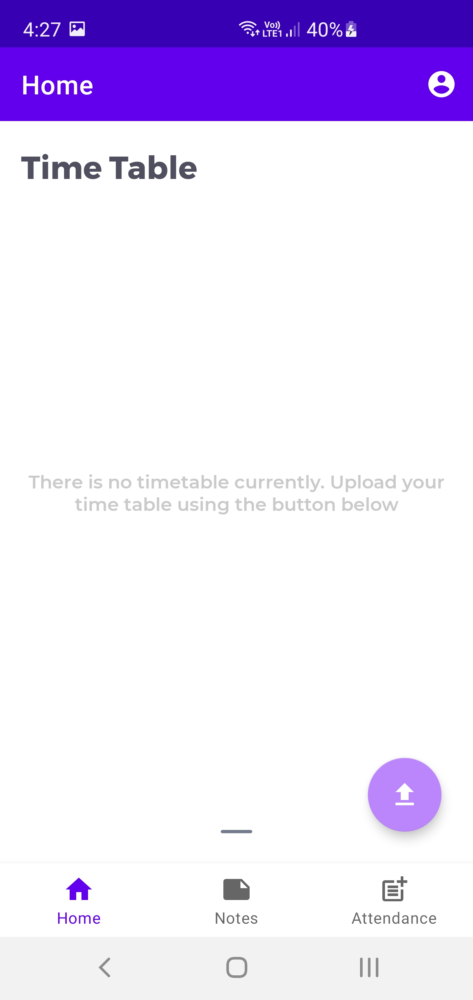
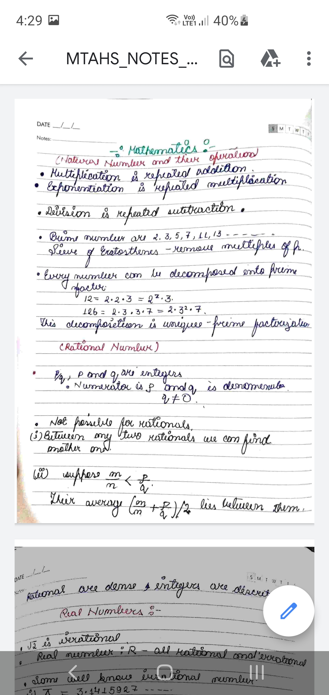

<div id="top"></div>

[![Contributors][contributors-shield]][contributors-url]
[![Forks][forks-shield]][forks-url]
[![Stargazers][stars-shield]][stars-url]
[![Issues][issues-shield]][issues-url]
[![LinkedIn][linkedin-shield]][linkedin-url]


<!-- PROJECT LOGO -->
<br />
<div align="center">
  <a href="https://github.com/Rigzbot/CollegeBuddy/blob/master/">
    
  </a>

  <h3 align="center">College Buddy</h3>

  <p align="center">
    An awesome assistant app for all your college needs.
    <br />
    <br />
    <a href="https://github.com/Rigzbot/CollegeBuddy/issues">Report Bug</a>
    ·
    <a href="https://github.com/Rigzbot/CollegeBuddy/issues">Request Feature</a>
  </p>
</div>


<!-- TABLE OF CONTENTS -->
<details>
  <summary>Table of Contents</summary>
  <ol>
    <li>
      <a href="#about-the-project">About The Project</a>
      <ul>
        <li><a href="#built-with">Built With</a></li>
      </ul>
    </li>
    <li>
      <a href="#getting-started">Getting Started</a>
      <ul>
        <li><a href="#prerequisites">Prerequisites</a></li>
      </ul>
    </li>
    <li><a href="#screenshots">ScreenShots</a></li>
    <li><a href="#roadmap">Roadmap</a></li>
    <li><a href="#contributing">Contributing</a></li>
    <li><a href="#contact">Contact</a></li>
    <li><a href="#acknowledgments">Acknowledgments</a></li>
  </ol>
</details>


<!-- ABOUT THE PROJECT -->
<div id="about-the-project"></div>

### About The Project

There are many college assistant apps on Github; however, I didn't find one that really suited my needs so I created this enhanced one. I wanted to create a college assistant 
app so amazing that it'll be the last one you will ever need.

Here's why:
* You can store all your notes in a sorted way, creating subject folders
* You can keep track of your attendance and look at current attendance in a glance
* You are able to store Id card and time table for easy access

Of course, no app is perfect as everyone's needs may be different. So I'll be adding more features in the near future. You may also suggest changes by forking this repo and creating a pull request or opening an issue. A big thanks to all contributors!

<p align="right">(<a href="#top">back to top</a>)</p>

<div id="built-with"></div>

### Built With

There were multiple technologies used to build this project. These are the major ones used.

* [Native Android](https://developer.android.com/docs)
* [Kotlin](https://kotlinlang.org/docs/home.html)
* [Firebase](https://firebase.google.com/?gclid=Cj0KCQiA_c-OBhDFARIsAIFg3ewrS-_4ATzMPwQXlBeXUXNyLrrMZQCLnsqVC1UMxUOuVku3qFvTKLUaAqTVEALw_wcB&gclsrc=aw.ds)
* [Room](https://developer.android.com/training/data-storage/room)
* [Material-Design](https://material.io/design)

<p align="right">(<a href="#top">back to top</a>)</p>


<!-- GETTING STARTED -->
<div id="getting-started"></div>

## Getting Started

Fork and clone repository in your local storage to start contributing.
   ```sh
   git clone https://github.com/Rigzbot/CollegeBuddy.git
   ```

<div id="prerequisites"></div>

### Prerequisites

<ol>
  <li>Android Studio.</li>
  <li>Latest version of Java JDK.</li>
</ol>

<p align="right">(<a href="#top">back to top</a>)</p>


<!-- SCREENSHOTS -->
<div id="screenshots"></div>

### ScreenShots

<table>
  <tr>
    <td>Login Screen</td>
     <td>Register User Screen</td>
  </tr>
  <tr>
    <td><a href="https://github.com/Rigzbot/CollegeBuddy/blob/master/">
    
      </a></td>   
  <td><a href="https://github.com/Rigzbot/CollegeBuddy/blob/master/">
    
    </a><td/>
  </tr>
  
  <tr>
      <td>Empty Time Table Hint</td>
      <td>Time Table Visible</td>
  </tr>
  </tr>
  <tr>
    <td><a href="https://github.com/Rigzbot/CollegeBuddy/blob/master/">
    
      </a></td>   
  <td><a href="https://github.com/Rigzbot/CollegeBuddy/blob/master/">
    
    </a><td/>
  </tr>
  
  <tr>
      <td>Your Subjects</td>
      <td>Delete Subjects</td>
  </tr>
  </tr>
  <tr>
    <td><a href="https://github.com/Rigzbot/CollegeBuddy/blob/master/">
    
      </a></td>   
  <td><a href="https://github.com/Rigzbot/CollegeBuddy/blob/master/">
    
    </a><td/>
  </tr>
  
  <tr>
      <td>Pdf Screen</td>
      <td>Delete Pdf</td>
  </tr>
  </tr>
  <tr>
    <td><a href="https://github.com/Rigzbot/CollegeBuddy/blob/master/">
    
      </a></td>   
  <td><a href="https://github.com/Rigzbot/CollegeBuddy/blob/master/">
    
    </a><td/>
  </tr>
  
  <tr>
      <td>View Pdf</td>
      <td>Empty Subjects Hint</td>
  </tr>
  </tr>
  <tr>
    <td><a href="https://github.com/Rigzbot/CollegeBuddy/blob/master/">
    
      </a></td>   
  <td><a href="https://github.com/Rigzbot/CollegeBuddy/blob/master/">
    
    </a><td/>
  </tr>
  
  <tr>
      <td>Id Card</td>
      <td>Attendance Screen</td>
  </tr>
  </tr>
  <tr>
    <td><a href="https://github.com/Rigzbot/CollegeBuddy/blob/master/">
    
      </a></td>   
  <td><a href="https://github.com/Rigzbot/CollegeBuddy/blob/master/">
    
    </a><td/>
  </tr>
  </table>
 
 
<p align="right">(<a href="#top">back to top</a>)</p>

<!-- ROADMAP -->
<div id="roadmap"></div>

### Roadmap

- [x] Base App
- [x] Store Attendance online
- [ ] Store Pdf's on cloud
- [ ] Add custom token to login with enrolment number
- [ ] Multi-language Support
    - [ ] Hindi

See the [open issues](https://github.com/Rigzbot/CollegeBuddy/issues) for a full list of proposed features (and known issues).

<p align="right">(<a href="#top">back to top</a>)</p>


<!-- CONTRIBUTING -->
<div id="contributing"></div>

### Contributing

Contributions are what make the open source community such an amazing place to learn, inspire, and create. Any contributions you make are **greatly appreciated**.

If you have a suggestion that would make this better, please fork the repo and create a pull request. You can also simply open an issue with the tag "enhancement" or "bug" 
according to the issue.
Don't forget to give the project a star! Thanks again!

1. Fork the Project
2. Create your Feature Branch (`git checkout -b feature/AmazingFeature`)
3. Commit your Changes (`git commit -m 'Add some AmazingFeature'`)
4. Push to the Branch (`git push origin feature/AmazingFeature`)
5. Open a Pull Request

<p align="right">(<a href="#top">back to top</a>)</p>

<!-- CONTACT -->
<div id="contact"></div>

### Contact

Rishik Gupta - [LinkedIn](https://www.linkedin.com/in/rishik-gupta-74a6a693/) - rishikgupta8@gmail.com

Project Link: [https://github.com/Rigzbot/CollegeBuddy](https://github.com/Rigzbot/CollegeBuddy)

<p align="right">(<a href="#top">back to top</a>)</p>


<!-- MARKDOWN LINKS & IMAGES -->
<!-- https://www.markdownguide.org/basic-syntax/#reference-style-links -->
[contributors-shield]: https://img.shields.io/github/contributors/RigzBot/CollegeBuddy.svg?style=for-the-badge
[contributors-url]: https://github.com/Rigzbot/CollegeBuddy/graphs/contributors
[forks-shield]: https://img.shields.io/github/forks/RigzBot/CollegeBuddy.svg?style=for-the-badge
[forks-url]: https://github.com/Rigzbot/CollegeBuddy/network/members
[stars-shield]: https://img.shields.io/github/stars/RigzBot/CollegeBuddy.svg?style=for-the-badge
[stars-url]: https://github.com/Rigzbot/CollegeBuddy/stargazers
[issues-shield]: https://img.shields.io/github/issues/RigzBot/CollegeBuddy.svg?style=for-the-badge
[issues-url]: https://github.com/Rigzbot/CollegeBuddy/issues
[linkedin-shield]: https://img.shields.io/badge/-LinkedIn-black.svg?style=for-the-badge&logo=linkedin&colorB=555
[linkedin-url]: https://www.linkedin.com/in/rishik-gupta-74a6a693/
[product-screenshot]: images/loginScreen.jpg
